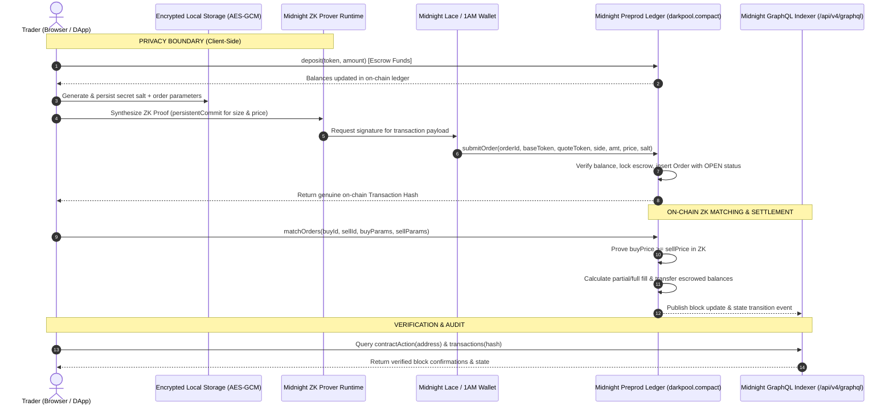

# Architecture: Midnight Dark Pool DEX

This document outlines the architectural flow, privacy boundaries, and cryptographic guarantees of the Midnight Dark Pool DEX.

---

## 1. Privacy Boundary Map & Sequence

---

## 2. Core Architectural Components

### 1. Smart Contract (`contracts/src/darkpool.compact`)
- **Balance Escrow & Real Settlement**: The `balances` mapping tracks escrowed token balances for each caller's public commitment. Traders must deposit funds before placing orders. When matched, base tokens and quote proceeds are atomically transferred between accounts directly on-chain.
- **Order Commitment Scheme**: Orders hide size and limit price using `persistentCommit<Uint<64>>` blinded by a random 256-bit salt.
- **Ownership & Authentication**: Cancellation requires proving knowledge of `callerSecret()` matching the stored `owner` commitment.
- **Continuous Matching with Partial Fills**: Matches calculate `fillAmount = min(buyRemaining, sellRemaining)`. Orders transition between `OPEN`, `PARTIALLY_FILLED`, and `FILLED`.
- **Cancellation & Refunds**: Cancelling an open or partially filled order atomically returns remaining unfilled escrowed assets to the user's `balances` ledger.

### 2. Client-Side Prover & Midnight DApp Connector
- Proving runs client-side using the wallet's proving provider (`dappConnector.getProvingProvider(...)`) or a configured Midnight proof server.
- Plaintext limits and trader secrets never cross the network boundary unblinded.
- Transaction submission returns genuine on-chain transaction IDs directly from the wallet provider.

### 3. Secure Private-State Storage (`frontend/src/lib/secureStorage.ts`)
- Client-side secret state (order salts, caller secrets, trade history) is encrypted using AES-GCM with a 256-bit key derived via PBKDF2.
- Supports encrypted backup export and import to safeguard order ownership across browser sessions.

### 4. Live Indexer & Independent Verification (`frontend/src/app/verify/page.tsx`)
- Public contract state and order events are queried from the Midnight Preprod GraphQL Indexer endpoint: `https://indexer.preprod.midnight.network/api/v4/graphql`.
- Verification performs real on-chain lookups for `contractAction` and transaction hashes with visible error handling when unconfirmed.
