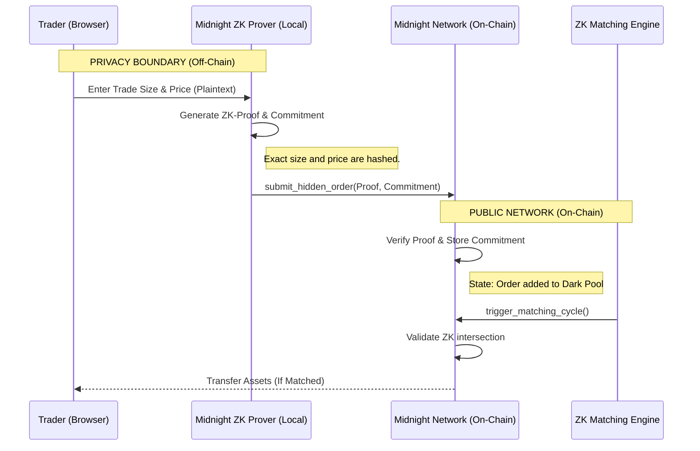

# Architecture: Midnight Dark Pool DEX (Level 6)

This document outlines the architectural flow and privacy boundaries of the Midnight Dark Pool DEX.

## Privacy Boundary Map

## Core Components
1. **Local Prover (Browser)**: The heavy lifting is done in the user's browser. When a user places an order, the browser generates a ZK-SNARK proof that they hold the funds, and creates a cryptographic commitment of the order details.
2. **Compact Smart Contract**: The on-chain contract stores ONLY the commitments. It does not know if an order is for 10 tokens or 10,000 tokens.
3. **Blurred Order Book UI**: The frontend reads aggregated bucket data (if implemented via an oracle or specific contract views) to show a heatmap of liquidity without exposing individual orders.

<!-- Verified matching engine ZK circuit flow v6.2 -->
<!-- Final Level 6 submission verification complete -->
